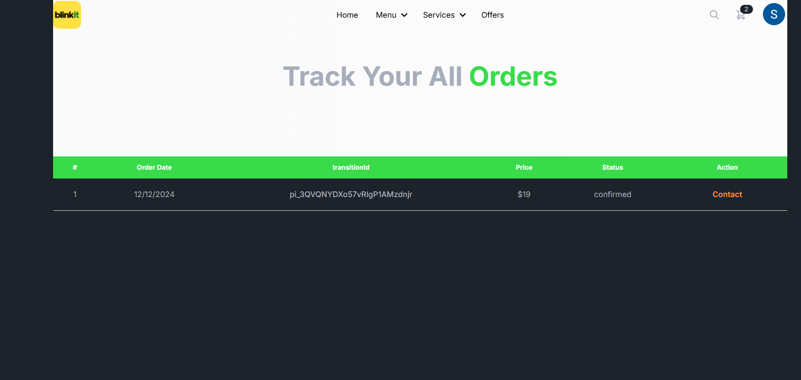

# Blinkit Client

## Table of Contents
1. [Overview](#overview)
2. [Website Screenshots Documentation](#website-screenshots-documentation)
   - [Landing Page](#landing-page)
   - [Home Page](#home-page)
   - [Sidebar](#sidebar)
   - [Admin Dashboard](#admin-dashboard)
   - [Menu Management](#menu-management)
   - [Orders](#orders)
   - [Kart](#kart)
   - [Payments](#payments)
   - [User Management](#user-management)
   - [Management](#management)
3. [Installation](#installation)
   - [Frontend Setup](#frontend-setup)
   - [Backend Setup](#backend-setup)
4. [Environment Variables Setup](#environment-variables-setup)
   - [Frontend Environment Variables](#frontend-environment-variables)
   - [Backend Environment Variables](#backend-environment-variables)
5. [Owner](#owner)

---

## Overview

This project demonstrates a full-stack MERN application. It utilizes a React-based frontend and an Express.js-powered backend. Both communicate through REST APIs, making it a robust foundation for modern web applications. 

---

## Website Screenshots Documentation

### Landing Page

The landing page serves as the entry point to the website, providing an overview and welcoming users to explore its features.

### Home Page
- **View 1**  
    
  This is the primary home page view, showcasing key features and navigation options.

- **View 2**  
    
  An alternative view of the home page, highlighting additional sections and user options.

### Sidebar

The sidebar provides quick access to various sections of the website, ensuring smooth navigation.

### Admin Dashboard

The admin dashboard allows administrators to monitor and manage the website's core functionalities efficiently.

### Menu Management
- **Menu Overview**  
    
  The menu overview displays all available menu categories, enabling easy browsing and updates.

- **Add New Menu**  
    
  This section allows administrators to add new menu items, ensuring the offerings are up-to-date.

- **Menu Items**  
    
  A detailed view of all menu items, complete with editing and organizational options.

### Orders

The orders page lists all customer orders, providing details and management capabilities for each order.

### Kart

The kart page displays items selected by users for purchase, along with checkout options.

### Payments

The payments section facilitates secure transactions, showcasing payment methods and history.

### User Management

The user management page allows administrators to manage user accounts, roles, and permissions.

### Management

This section provides tools and options for overall website management, ensuring seamless operations.

---

## Installation

Before proceeding, ensure you have [Node.js](http://nodejs.org) and [npm](https://npmjs.com) installed on your system.

### Frontend Setup

1. Clone or download the project and unzip the files.
2. Navigate to the `frontend` directory:
   ```sh
   cd frontend
   ```
3. Install dependencies:
   ```sh
   npm install
   ```
4. Start the development server:
   ```sh
   npm run dev
   ```
5. Create a `.env.local` file in the root of the `frontend` directory and include the following variables:
   ```env
   VITE_APIKEY=<Firebase API Key>
   VITE_AUTHDOMAIN=<Firebase Auth Domain>
   VITE_PROJECTID=<Firebase Project ID>
   VITE_STORAGEBUCKET=<Firebase Storage Bucket>
   VITE_MESSAGINGSENDERID=<Firebase Messaging Sender ID>
   VITE_APPID=<Firebase App ID>
   VITE_IMAGE_HOSTING_KEY=<IMGBB API Key>
   VITE_STRIPE_PK=<Stripe Publishable Key>
   ```

### Backend Setup

1. Navigate to the `backend` directory:
   ```sh
   cd backend
   ```
2. Install dependencies:
   ```sh
   npm install
   ```
3. Start the server:
   ```sh
   npm start
   ```
4. Create a `.env` file in the root of the `backend` directory and include the following variables:
   ```env
   DB_USER=<MongoDB Username>
   DB_PASS=<MongoDB Password>
   ACCESS_TOKEN_SECRET=<JWT Secret Token>
   PAYMENT_SECRET_KEY=<Stripe Secret Key>
   ```

---

## Environment Variables Setup

### Frontend Environment Variables

1. **Firebase Variables:**
   - Go to the [Firebase Console](https://console.firebase.google.com/).
   - Log in using your Google account.
   - Click on **Add Project** and follow the steps to create a new Firebase project.
   - Once the project is created, navigate to **Project Settings** > **General**.
   - Scroll down to the **Your apps** section, click **Add app**, and select **Web**.
   - Follow the steps to register your app, and Firebase will generate the API details (API key, Auth Domain, etc.). Copy these values for your `.env.local` file.

2. **IMGBB API Key:**
   - Visit [IMGBB](https://imgbb.com/).
   - Create an account or log in if you already have one.
   - Navigate to your account dashboard and click on **API**.
   - Generate a new API key and copy it for your `.env.local` file.

3. **Stripe Publishable Key:**
   - Log in to your [Stripe Dashboard](https://stripe.com/).
   - Navigate to **Developers** > **API keys**.
   - Copy the **Publishable Key** and paste it into your `.env.local` file.

### Backend Environment Variables

1. **MongoDB Credentials:**
   - Go to the [MongoDB Atlas](https://www.mongodb.com/atlas) dashboard.
   - Log in or sign up for an account.
   - Create a new cluster or use an existing one.
   - In the cluster dashboard, navigate to **Database Access** under the **Security** section.
   - Click **Add New Database User**, set a username and password, and select the appropriate access level.
   - Use these credentials for `DB_USER` and `DB_PASS` in your `.env` file.

2. **JWT Secret Token:**
   - Use a secure method to generate a random string. For example, you can use the following command in a terminal:
     ```sh
     openssl rand -hex 64
     ```
   - Copy the generated string and paste it as the value for `ACCESS_TOKEN_SECRET` in your `.env` file.

3. **Stripe Secret Key:**
   - Log in to your [Stripe Dashboard](https://stripe.com/).
   - Navigate to **Developers** > **API keys**.
   - Copy the **Secret Key** and paste it as the value for `PAYMENT_SECRET_KEY` in your `.env` file.

---

## Owner

This project is primarily for the Upgrad capstone project by **Sabreesh Devanathan**.
